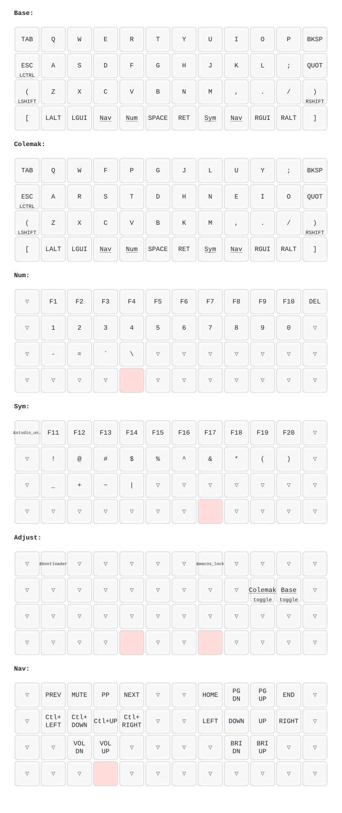
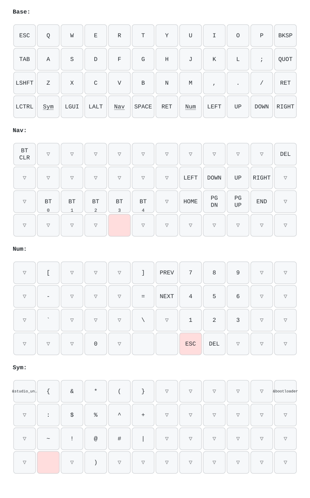

# ZMK Firmware

# Blank Slate
- Default keymap
- [blank-slate-zmk-module](https://github.com/petejohanson/blank-slate-zmk-module)
- ZMK Studio enabled
- PCB available at [keycapsss.com](https://keycapsss.com/keyboard-parts/pcbs/260/blank-slate-ortholinear-wireless-keyboard-pcb-olkb-planck-case-compatible)

## Keymaps

### Felerius Blank Slate
<!-- KEYMAP_SVG:felerius_blank_slate:START -->

<!-- KEYMAP_SVG:felerius_blank_slate:END -->

### LP Galaxy Blank Slate
<!-- KEYMAP_SVG:lpgalaxy_blank_slate:START -->

<!-- KEYMAP_SVG:lpgalaxy_blank_slate:END -->

# How to Use (Local Compilation)

This project uses a `Makefile` to simplify building ZMK firmware locally using Docker. This ensures a consistent environment matching the CI build.

## Prerequisites
- **Docker**: Ensure Docker is installed and running on your machine.
- **Terminal**: A standard terminal (zsh, bash).

## Quick Start

### 1. Initialize the Environment
If this is your first time, clone the ZMK firmware and initialize the modules:
```bash
make base
```

### 2. Build Firmware

Build all firmwares and keymap SVGs:
```bash
make
```
This command will:
- Spin up a Docker container.
- Mount your local config.
- Build the firmware using `west`.
- Copy the resulting `.uf2` file to the `firmware/` directory.

Or build individually:
```bash
make only_felerius_blank_slate  # Felerius variant
make only_slate                 # LP Galaxy variant
```

Output: `.uf2` files in `firmware/`, SVGs in `docs/keymaps/`

### 3. Other Commands
```bash
make draw_all       # Generate keymap SVGs only
make shell          # Open shell in ZMK container
make clean_firmware # Remove uf2 files in frimware folder
make clean_zmk      # Remove zmk folder
make clean_docker   # Remove docker images and volumes
make clean_all      # Remove all build artifacts
```
